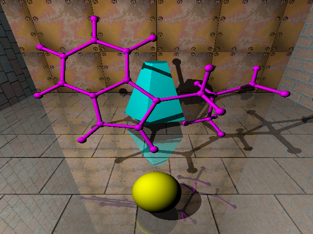

# mikraytrace

A weekend project to build a simple raytracer in C++. 




### Installation instructions

Firstly, install the required libraries and tools. In Debian, or in 
a Debian-like Linux, this can be done like so:

```
apt-get install build-essential libpng-dev libpng++-dev libeigen3-dev \
    libeasyloggingpp-dev libopenbabel-dev
```

Secondly, you need the cpptoml library from Git. Install it by updating 
the submodules in the main directory:

```
cd mikraytrace/
git submodule update --init --recursive
```

Thirdly, you may need some textures. Enter the textures directory 
and download them automatically from OpenGameArt.org website. Note that some
downloaded textures are in formats other than PNG and have to be converted
before they can be used. This is done automatically too, but make sure that
you have ImageMagick installed. Otherwise, convert them to PNG format manually.

```
cd mikrayrace/textures/
bash gettex.sh
```

Now you may want to review the Makefile. If everything looks okay, run make in 
the main directory. This should generate the executable file mrtp\_cli. 

```
cd mikraytrace/
make
```

In order to test the program, render the example scene:

```
./mrtp_cli bluemol.toml
```

