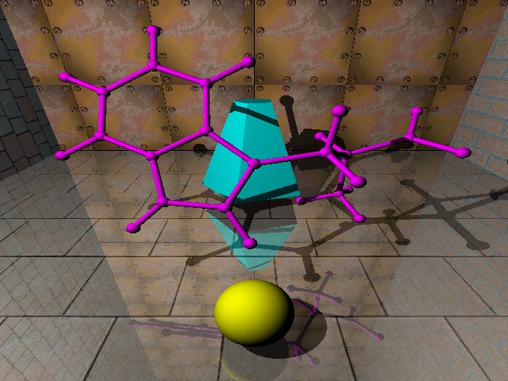

# mikraytrace

A hobby project to create a simple portable raytracer in C++. 

<div align="center">
    
</div>

### Build instructions

Firstly, install the required tools if not already present:

```
mikraytrace > apt-get install build-essential cmake
```

Some external libraries are used for image processing (toojpeg98 and lodepng); these 
are vendored directly.

Secondly, you may need example textures. I created a [texture pack](https://drive.google.com/file/d/1j9sTHGRlamizDvwZmB7ZeNoZRA_oAIDM/view?usp=drive_link) based on free textures from OpenGameArt.org.
Create a `textures` directory and unpack the textures there.

Finally, build the project using one of the build scripts. 

The Watcom script looks for the compiler at `/home/mikolaj/open-watcom-v2` by default; 
set the `WATCOM` environment variable to override this.

In order to test the program, render the example scene, e.g.:

```
mikraytrace > ./build-gcc/mrtp_cli bluemol.toml
```
