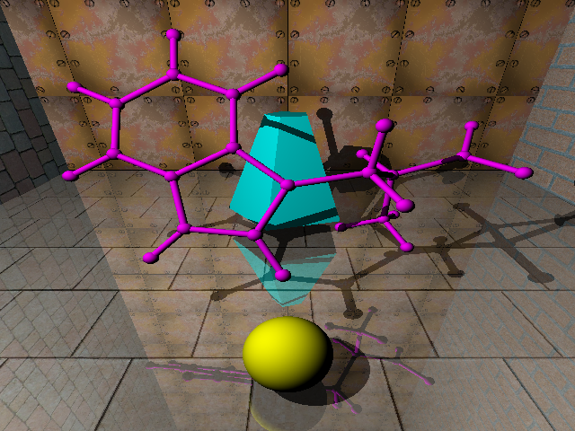

# mikraytrace

A hobby raytracer in C++. 

<div align="center">
    
</div>

## Features

- Written in portable C++98, compatible with GCC, DJGPP, and Open Watcom v2 (Linux and MS-DOS targets)
- 3D scenes are described in a simple text format
- Outputs rendered images as PNG or JPEG
- Multi-threaded rendering on platforms with OpenMP support

## Build instructions

Install the required tools if not already present:

```
mikraytrace > apt-get install build-essential cmake
```

Some external libraries are used for image processing (toojpeg98 and lodepng); these 
are vendored directly.

You will also need example textures. I created a [texture pack](https://drive.google.com/file/d/1j9sTHGRlamizDvwZmB7ZeNoZRA_oAIDM/view?usp=drive_link)
based on free textures from OpenGameArt.org. Create a `textures` directory and 
unpack them there.

The project is built with CMake. Use any of the attached build scripts, like so:

```
mikraytrace > ./build-gcc-linux.sh
```

The MS-DOS build scripts have hardcoded compiler paths; set the `WATCOM` and `DJGPP` 
environment variables to override this.

Render a scene by passing one or more scene files to `mrtp_cli`:

```
mikraytrace > ./build-gcc/mrtp_cli bluemol.txt
```

## Makefiles

Plain makefiles are provided. They build `mrtp_cli` in the source tree:

| Makefile       | Host   | Target | Compiler        | Build system | Output         | OpenMP | Command                     |
|----------------|--------|--------|-----------------|--------------|----------------|--------|-----------------------------|
| `makefile`     | Linux  | Linux  | GCC             | GNU make     | `mrtp_cli`     | Yes    | `make`                      |
| `makefile.wcl` | Linux  | Linux  | Open Watcom v2  | GNU make     | `mrtp_cli`     | No     | `make -f makefile.wcl`      |
| `makefile.dj`  | Linux  | MS-DOS | DJGPP           | GNU make     | `mrtp_cli.exe` | No     | `make -f makefile.dj`       |
| `makefile.wc`  | Linux  | MS-DOS | Open Watcom v2  | GNU make     | `mrtp_cli.exe` | No     | `make -f makefile.wc`       |
| `makefile.ddj` | MS-DOS | MS-DOS | DJGPP           | GNU make     | `mrtp_cli.exe` | No     | `make -f makefile.ddj`      |
| `makefile.dwc` | MS-DOS | MS-DOS | Open Watcom v2  | wmake        | `mrtp_cli.exe` | No     | `wmake -f makefile.dwc`     |

Some makefiles have hardcoded compiler paths; set the `WATCOM` and `DJGPP` environment 
variables to override this, e.g. `make -f makefile.wc WATCOM=/opt/watcom`.

When building under MS-DOS, the compiler environment should be set up beforehand (see inside 
comments).

The Watcom MS-DOS executables require the DOS/4GW extender, and the DJGPP ones require 
a DPMI host such as CWSDPMI.
